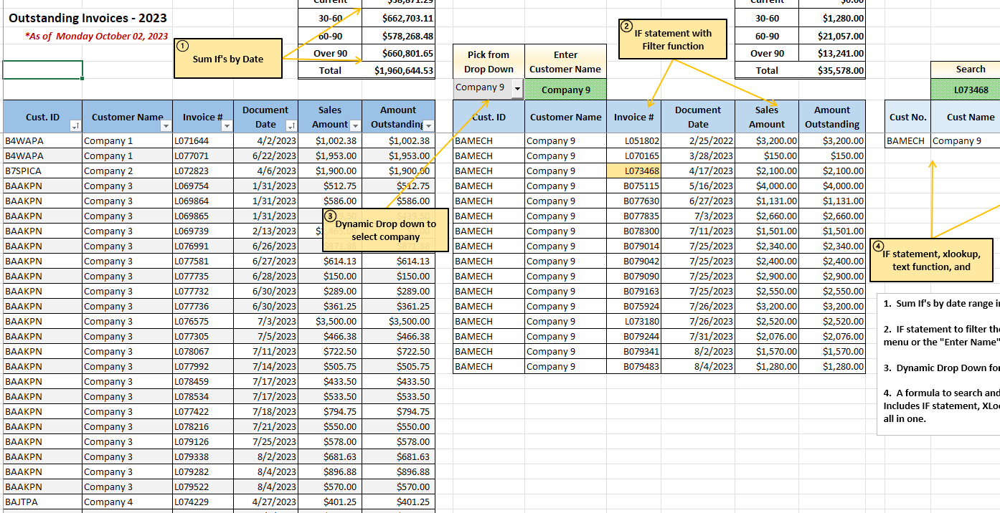
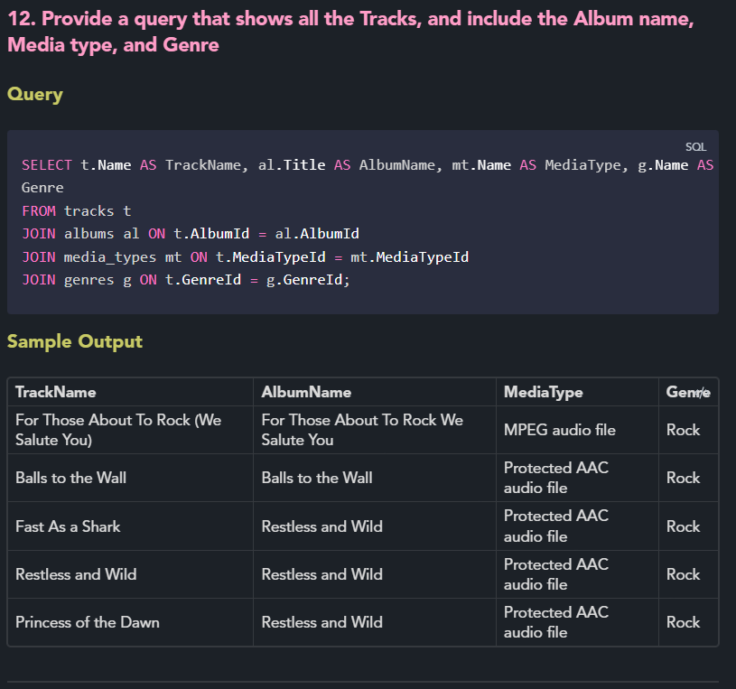
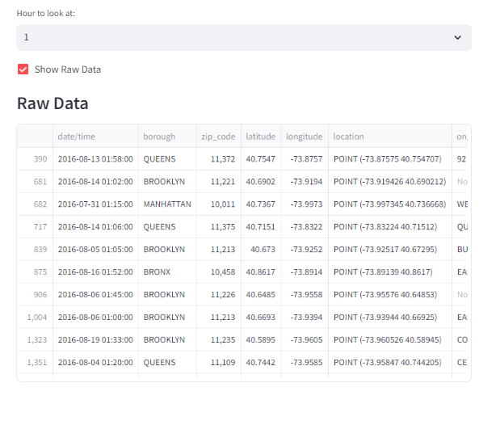

# Mike Rice's Data Portfolio

## Introduction

Hello! I'm Mike, with a career mostily in accounting and finance I am using this portfolio to showcase some of my additional formula creation, reporting, and technical skills focused on data analysis, visualization, and automation. I have been exploring various methods and languages and am constantly excited to learn new material to expand my technological skillset.

## Contents

- **Excel Projects**: Various data analysis and visualization projects done in Excel.
- **Jupyter Notebooks**: Data analytics projects executed in Jupyter notebooks.
- **SQL Projects**: SQL queries and database designs showcased in Markdown files with code snippets and tables.
- **Python Scripts**: Automation and data manipulation scripts written in Python.

## Navigating the Repository

Each project or script is stored in its own directory. A brief description of each project can be found in its corresponding README file.

Below is a peek at what's inside the folders:

# Advanced Excel Formulas

# Data Analysis with Jupyter Notebooks

## 🎾**Tennis Dataset Analysis notebook**🎾

**- [https://nbviewer.org/github/mdr5002/Portfolio/blob/main/TennisData/TennisData.ipynb](https://nbviewer.org/github/mdr5002/Portfolio/blob/main/Jupyter-nb/TennisData.ipynb)**

## 🚗⛽**Miles per gallon Anaysis notebook**

**- https://nbviewer.org/github/mdr5002/Portfolio/blob/main/Jupyter-nb/mpg-exp.ipynb**

## A SQL project with queries and sample output

## Power BI Dashboards

I've also created a Python web app with Streamlit

# Streamlit Web App

Created using motor vehicle collision data from Kaggle and tutorial on Coursea. An interactive web application with dynamic sliders and data filters. The output images are below and the project is located in my Python_web folder

## Contact

Feel free to reach out on [LinkedIn](https://www.linkedin.com/in/michael-rice-24704953/) or email mrice0012@gmail.com

## License

This project is licensed under the MIT License - see the [LICENSE](LICENSE) file for details.
